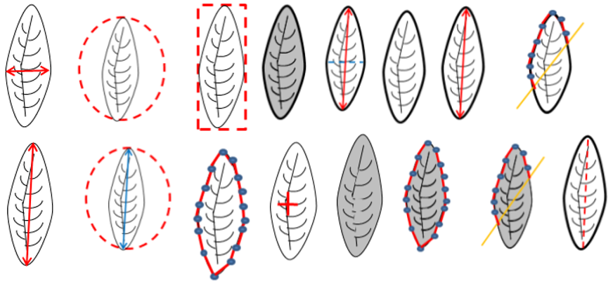

# Algorithm for leaves classification

## MEDIPI (**MEDI**icinal **P**lant **I**dentification) algorithm 

Medicinal plants are usually identified by practitioners based on years of experience through
sensory or olfactory senses. The other method of recognizing these plants involves Laboratory-
based testing, which requires trained skills, data interpretation which is costly and time-intensive. Automatic ways to identify medicinal plants are useful especially for those that are lacking experience in herbal recognition. We introduce a computationally efficient new algorithm for medicinal plant classification.  We
refer to our medicinal plant classification algorithm as MEDIPI : MEDIicinal Plant
Identification. MEDIPI
contains two main phases (i) The offline phase, and (ii) The online phase. The algorithm operates on a set of interpretable features  computed from the leaf images. The offline phase of the algorithm contains 4 main steps: i) image processing, ii) feature extraction, iii) train a algorithm. Figure 1 provides an overview of our algorithm. Figure 2 provides a selected set of features we use in the algorithm. The image processing steps are shown in Figure 3.


Figure 1: Overview of MEDIPI algorithm




Figure 2: Leaf image features


Figure 3: Image processing workflow


# Benchmark dataset for plant leaves classification


Researchers usually struggle and spend a lot of time
establishing a database by gathering many leaf samples as raw data. By sharing our database we
provide a training/test database to other researchers to develop new algorithms or to evaluate their algorithms. Furthermore,  data
sharing encourages more connections and collaboration between scientists, which leads to better decision-making.

## R Software Package `MedLEA`: **Med**icinal **LEA**f


The [MedLEA](https://github.com/SMART-Research/MedLEA) package provides two datasets.

i) A dataset of morphological and structural features of 471 medicinal plant leaves. The features of each species are recorded by manually viewing the medicinal plant repository available at (<http://www.instituteofayurveda.org/plants/>). For more information visit at <https://github.com/SMART-Research/MedLEA>.


Figure 4:  Some morphological characteristics of profiles

ii) Leaf image data set:  A database of leaf images of medicinal plants in Sri Lanka is
not yet available. Hence, through this research, we establish a repository of medicinal
plant images. This repository contains 1099 leaf images of 31 species. There are 29-45 images per species. 


Figure 5: Few samples from the MedLEA images

You can get access to the data set via the MedLEA package. 

```{r, eval=FLASE}
install.packages("MedLEA")
```


# Research outputs

**Papers**

[Lakshika, J. P., & Talagala, T. S. (2021). Computer-aided Interpretable Features for Leaf Image Classification. arXiv preprint arXiv:2106.08077.](https://arxiv.org/abs/2106.08077)


**Software**

Jayani P. G. Lakshika and Thiyanga S. Talagala (2021). MedLEA: Morphological and Structural Features of Medicinal Leaves. R package version 1.0.1.
https://CRAN.R-project.org/package=MedLEA


[](https://CRAN.R-project.org/package=MedLEA)
[](https://cran.r-project.org/package=MedLEA)

<blockquote class="twitter-tweet"><p lang="en" dir="ltr">Do you want a new data package for teaching? MedLEA package provides morphological and structural features of 471 medicinal plant leaves and 1099 leaf images of 31 species and 29-45 images per species. <a href="https://t.co/y14wvvMBH8">https://t.co/y14wvvMBH8</a> <a href="https://twitter.com/hashtag/rstats?src=hash&amp;ref_src=twsrc%5Etfw">#rstats</a> <a href="https://twitter.com/hashtag/DataVisualization?src=hash&amp;ref_src=twsrc%5Etfw">#DataVisualization</a> <a href="https://twitter.com/hashtag/dataviz?src=hash&amp;ref_src=twsrc%5Etfw">#dataviz</a> <a href="https://twitter.com/hashtag/MachineLearning?src=hash&amp;ref_src=twsrc%5Etfw">#MachineLearning</a> <a href="https://t.co/rYpyj16rTs">pic.twitter.com/rYpyj16rTs</a></p>&mdash; Thiyanga Talagala (@thiyangt) <a href="https://twitter.com/thiyangt/status/1381060311357136896?ref_src=twsrc%5Etfw">April 11, 2021</a></blockquote> <script async src="https://platform.twitter.com/widgets.js" charset="utf-8"></script>

**Conference talks**

[Click here](https://www.youtube.com/channel/UCqfu75XVtV4s-W5aiw1tavQ)

**Research reproducibility**

R codes and data to reproduce the results in the paper "Computer-aided Interpretable Features for Leaf Image Classification" available at https://github.com/SMART-Research/leaffeatures_paper


This work is a part of [Jayani P G Lakshika](https://www.linkedin.com/in/jayani-lakshika-9a0297162/) BSc (Hons) Degree in Statistics thesis - 2021, which was supervised by me.


