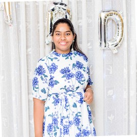
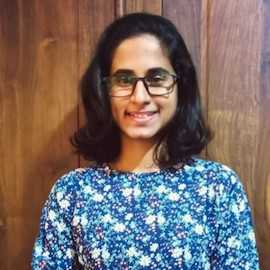
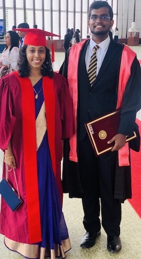
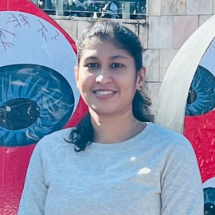
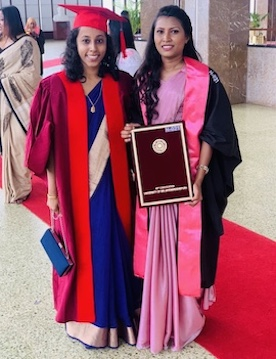

---
header:
  caption: ""
  image: ""
layout: docs
title: Students
---
# Current research students

|       ||
|:-----:|:---|
| [Udeshi Salgado](https://www.linkedin.com/in/udeshi-salgado/?originalSubdomain=lk)   | **Thesis title:** Deep learning for dental caries detection **Degree:** BSc (Hons) Statistics - Reading  |
| [Lakna Perera](https://www.linkedin.com/in/lakna-perera/?trk=public_profile_browsemap&originalSubdomain=lk)   |**Thesis title:** Spatio-temporal forecasting of rainfall in Sri Lanka  **Degree:** BSc (Hons) Statistics - Reading
|

# Former research students

|       ||
|:-----:|:---|
|[ Janith Wanniarachchi](https://janithwanni.netlify.app/)  |**Thesis title:** Transparency, auditability and explainability of interpretable machine learning methods **Degree:** BSc (Hons) Statistics - 2022 **Current position:** R Shiny Developer at [Appsilon](https://appsilon.com/) **Awards:** SLAAS Physical Science Award Winner - 2022 |
|[ Jayani Lakshika](https://jayanilakshika.netlify.app/)  | **Thesis title:** Computer vision system for automatic Sri Lankan medicinal plant identification **Degree:** BSc (Hons) Statistics - 2021 **Current position:** PhD Candidate, Monash University, Australia **Awards** Fully funded Monash University PhD Scholarship |
|[Samudra Madhushani](https://darecentre.org.au/portfolio_page/samudra-madushani/)|**Thesis title:**  [Hierarchical Forecasting of Dengue Incidence in Sri Lanka](https://samudramadushani.github.io/HierarchicalForecasting/SlidesCodingR.html#1) **Degree:** MSc in Applied Mathematics - 2021 **Current position:** PhD Candidate, University of New South Wales, AUstralia **Awards:**Fully funded PhD Scholarship from [DARE](https://darecentre.org.au/) and NSW|

# Industrial Training Supervision 

|     ||
|:---:|:---|
|    [Randi Shashikala](https://www.linkedin.com/in/randi-shashikala-b885351b8/)         | **Research project:** [Interactive Dashboard to Monitor the COVID-19 Outbreak and Vaccine Administration](https://thiyangt.github.io/coviddashboard/) **Degree:** BSc (Hons) Statistics - 2022 **Current Position:** Analyst, Actuarial and Analytics Team, Fairfirst Insurance |

