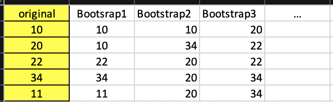
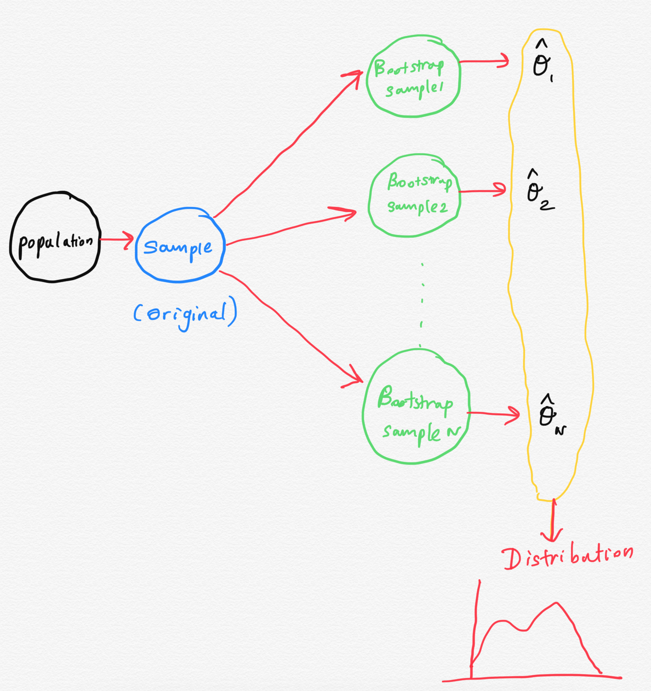

```{r setup, include=FALSE}
options(htmltools.dir.version = FALSE)
library(emo)
```

<!--https://statisticsbyjim.com/hypothesis-testing/bootstrapping/-->

# What is a bootstrap?


- Bootstrap is a method of inference.

- Bradley Efron first introduced this approach in 1979.

    - Link to his original paper is [here](https://projecteuclid.org/euclid.aos/1176344552).
    


- Bootstrapping is a computer-intensive procedure.


---

# Applications

- Estimate the standard error of any statistic and to obtain a confidence interval (CI) for it.

- This is useful when CI doesn't have a closed form, or it has a very complicated one.

- Hypothesis testing

- Bootstrap sampling in regression, etc.


## Three forms of bootstrapping 

- Nonparametric (resampling)

- Semiparametric (adding noise)

- Parametric (simulation)

<!--https://online.stat.psu.edu/stat555/node/119/-->

<!--There are three forms of bootstrapping which differ primarily in how the population is estimated. Most people who have heard of bootstrapping have only heard of the so-called nonparametric or resampling bootstrap.-->

---
##  Bootstrapping Resamples 

- The bootstrap sample is the same size as the original sample data. 

- As a result, some observations will be represented multiple times in the bootstrap sample while others will not be selected at all.

## Example of Bootstrap Samples




- Bootstrapping does not new data set from the population. 

- It treats the original sample as a proxy for the real population and then draws random samples from it. 

- Consequently, the central assumption for bootstrapping is that the original sample accurately represents the actual population.
 
---

# Steps

1. Take a sample from population. This is called the **original sample**. Suppose the sample size is $n$.

2. Draw a sample from the original sample data with replacement with size $n$ and repeat this step $N$ times.

3. Compute the statistic of $\theta$ for each Bootstrap Sample, and there will be totally $N$ estimates of $\theta$.

4. Construct a sampling distribution with these $N$ Bootstrap statistics and use it to make further statistical inference.
---



---
## Differences between Bootstrapping and Traditional Inference Methods

- how they estimate sampling distributions

- "The traditional approach also uses theory to tell what the sampling distribution should look like, but the results fall apart if the assumptions of the theory are not met. The bootstrapping method, on the other hand, takes the original sample data and then resamples it to create many bootstrap samples."

> source: towards data science.

<!--https://towardsdatascience.com/bootstrapping-statistics-what-it-is-and-why-its-used-e2fa29577307#:~:text=The%20traditional%20approach%20also%20uses,create%20many%20%5Bsimulated%5D%20samples.-->


---

## Example 1

<!--http://bcs.whfreeman.com/webpub/statistics/ips9e/9781319013387/companionchapters/companionchapter16.pdf-->

Height of randomly selected individuals 

```{r, comment=NA}
height <- c(5.2, 6.1, 5.5, 5.4, 5.3)
height
```

1.  Construct 100 bootstrap samples.

2. Calculate the sample mean for each of the resamples. 

3. Make a histogram of the means of the 100 bootstrap samples. This is the bootstrap distribution.

4.  Calculate the bootstrap standard error. 

---
## Example 1 (cont.)

Help:

$$\bar{X*} = \frac{1}{N}\sum_{i=1}^N\bar{x}_{i}^{bootstrap}$$

$$se(\bar{X*}) =\sqrt{\frac{1}{B-1}\sum_{i=1}^N (\bar{x}_{i}^{bootstrap} - \bar{X*})^2}$$

The bootstrap standard error, of a statistic is the standard deviation of the bootstrap distribution of that statistic.

---

## Classical confidence interval

$$[\bar{x}- t_{\alpha/2, n-1}se(\bar{x}), \bar{x}- t_{\alpha/2, n-1}se(\bar{x})]$$

## Confidence intervals via bootstrap

- `boot` package can generate bootstrap samples.

- Step 1: To use the `boot` function for drawing samples, you need a function to compute the statistic of interest.

```{r, comment=NA}
samplemean <- function(data, indices) {
  return(mean(data[indices]))
}

```

It should have at least two arguments: 

  i) `data`: the original data

  ii) a vector containing `indices`: frequencies or weights which define the bootstrap sample.

`data[indices]` Creates the bootstrap sample (i.e., subset the provided data by the “indices” parameter). “indices” is automatically provided by the “boot” function; this is the sampling with replacement portion of bootstrapping.

---

## Confidence intervals via bootstrap (cont.)

Step 2: Conduct the bootstrapping

```{r, comment=NA}
library(boot)
result <-  boot(data = height, statistic = samplemean, R = 1000)
result
```

<!--http://people.tamu.edu/~alawing/materials/ESSM689/Btutorial.pdf-->


---

## View some calculated statistics of boot object

.pull-left[

**Bootstrap sample means**
```{r, comment=NA}
result$t
```
]

.pull-right[

**Original sample mean**

```{r, comment=NA}
mean(height)
```

]


---

## Understanding the output

```{r, comment=NA}
result
```


```{r, comment=NA}
mean(height)
mean(result$t) - mean(height)
sd(result$t)
```

---
## Confidence intervals via bootstrap (cont.)

**Method 1:**

The 95% bootstrap confidence interval is

```{r, comment=NA}
c(sort(result$t)[25],sort(result$t)[975])
```

**Method 2:**


```{r, comment=NA}
boot.ci(result, type="all")
```

---


## Confidence intervals via bootstrap (cont.)

1. Normal

2. Basic

3. Percentile

4. BCa (“Bias Corrected and Accelerated)

Reading here: https://www.r-bloggers.com/2019/09/understanding-bootstrap-confidence-interval-output-from-the-r-boot-package/

---

## Hypothesis testing

$$H_0: \mu =5$$

$$H_1: \mu \neq 5$$

```{r, comment=NA}
boot.ci(result, type="all")
```

5 is outside the interval. Hence, $H_0$ would be rejected under 0.05 level of significance. We can conclude that population mean is significantly different from 5.


---

## Your turn

Compute bootstrap confidence interval for median.

data: `heights`

---
## Answer

```{r, comment=NA, message=FALSE}
samplemedian <- function(data, indices) {
  return(median(data[indices]))
}

resultmedian <-  boot(data = height, statistic = samplemedian, R = 1000)
resultmedian


```


---

## Answer (cont.)

```{r, comment=NA, message=FALSE}
boot.ci(resultmedian, type="all")
```


---
## Jackknife Approach


 - Unlike bootstrap, jackknife is an iterative process. A parameter is calculated on the whole dataset and it is repeatedly recalculated by removing an element one after another.
 
 - The main application of jackknife is to reduce bias and evaluate variance for an estimator.
 
---

## Exercise

Construct 

- CIs for median `Sepal.Length`, 

- CIs for median `Sepal.Width` and

- CIs for Spearman's rank correlation coefficient between  `Sepal.Length` and `Sepal.Width`

using bootstrap sampling.

Data: `iris`

---

class: center, middle

Slides available at: https://thiyanga.netlify.app/courses/rmsc2020/contentr/

All rights reserved by [Thiyanga S. Talagala](https://thiyanga.netlify.com/)


