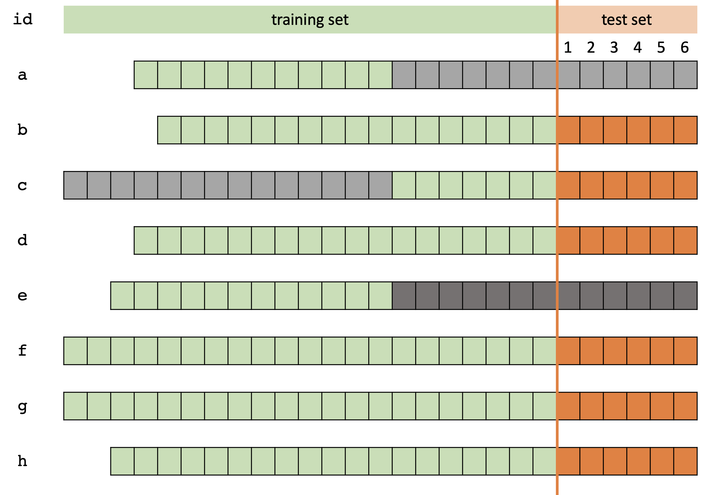

```{r setup, include=FALSE}
options(htmltools.dir.version = FALSE)
```


# Forecasting competitions

- Forecasting competitions have played a significant role in the advancement of forecasting practices. 

    
- Objectives

    - Examine the relative performance of forecasting methods under different circumstances.
    
    - Identify best practices and gain knowledge.


- Organizing a competition:

    - Data collection
    
    - Data processing 
    
    - Evaluate forecasts to rank the submissions.


---
# What is data leakage?


```{r, comment=NA, echo=FALSE, message=FALSE, warning=FALSE, fig.align='center', fig.height=7, fig.width=10}
library(tidyverse)
set.seed(15102020)
t <- seq(0, 10, 0.1)
y <- sin(t) + rnorm(100)
y <- y + 100
time <- 1:length(t)
col1 <- c(rep(1, 5), rep(0, 44), rep(1, 52))
traintest <- c(rep(1, 81), rep(0, 20))
h1 <- c(rep(1, 5), rep(0, 24), rep(1, 72))
h2 <- c(rep(1, 5), rep(0, 44), rep(1, 52))
df1 <- data.frame(y=y, time=time, col=col1, traintest=traintest, h=rep(1, 101), 
                  h1=h1, h3=col1)
t2 <- seq(0, 10, 0.1)
y2 <- cos(t2) + rnorm(25, sd=0.05) + 100
y2 <- c(y2, y[5:50]) 
t3 <- 1: 101
col2 <- c(rep(1, 101), rep(0, 46))
h <- c(rep(1, 101), rep(0, 26), rep(1, 20))[46:146]
df2 <- data.frame(y=y2[46:146], time=t3, col=col2[46:146], traintest=traintest,
                  h=h, h1=h, h3=h)
dfCombined <- bind_rows(df2, df1)
dfCombined$dfindex <- c(rep("a", nrow(df1)), rep("b", nrow(df2)))

ggplot(dfCombined, aes(y=y, x=time), group=1) + 
  geom_line() +  aes(group=NA) +
  facet_wrap(vars(dfindex), ncol=1) + 
  theme(legend.position = "none")


```

---

# What is data leakage?

```{r, comment=NA, echo=FALSE, message=FALSE, warning=FALSE, fig.align='center', fig.height=7, fig.width=10}
ggplot(dfCombined, aes(y=y, x=time, col=factor(traintest)), group=1) + 
  scale_colour_manual(values = c("black", "black"))+
  geom_line() +  aes(group=NA) +
  facet_wrap(vars(dfindex), ncol=1) + 
  theme(legend.position = "none") + 
  geom_vline(xintercept=82, colour="#66a61e", lwd=1) +
  annotate("rect", xmin = 82, xmax = 101, ymin = 97.11, ymax = 103.38, 
            alpha = 0.5, fill = c("yellow") )
```


---

# What is data leakage?

```{r, comment=NA, echo=FALSE, message=FALSE, warning=FALSE, fig.align='center', fig.height=7, fig.width=10}

ggplot(dfCombined, aes(y=y, x=time, col=factor(h)), group=1) + 
  scale_colour_manual(values = c("red", "black"))+
  geom_line() +  aes(group=NA) +
  facet_wrap(vars(dfindex), ncol=1) + 
  theme(legend.position = "none") + 
  geom_vline(xintercept=82, colour="#66a61e", lwd=1) +
  annotate("rect", xmin = 82, xmax = 101, ymin = 97.11, ymax = 103.38, 
            alpha = 0.5, fill = c("yellow") )
```

---

# What is data leakage?

```{r, comment=NA, echo=FALSE, message=FALSE, warning=FALSE, fig.align='center', fig.height=7, fig.width=10}
ggplot(dfCombined, aes(y=y, x=time, col=factor(h1)), group=1) + 
  scale_colour_manual(values = c("red", "black"))+
  geom_line() +  aes(group=NA) +
  facet_wrap(vars(dfindex), ncol=1) + 
  theme(legend.position = "none") + 
  geom_vline(xintercept=82, colour="#66a61e", lwd=1) +
  annotate("rect", xmin = 82, xmax = 101, ymin = 97.11, ymax = 103.38, 
            alpha = 0.5, fill = c("yellow") )

```


---

# What is data leakage?

```{r, comment=NA, echo=FALSE, message=FALSE, warning=FALSE, fig.align='center', fig.height=7, fig.width=10}

ggplot(dfCombined, aes(y=y, x=time, col=factor(h3)), group=1) + 
  scale_colour_manual(values = c("red", "black"))+
  geom_line() +  aes(group=NA) +
  facet_wrap(vars(dfindex), ncol=1) + 
  theme(legend.position = "none") + 
  geom_vline(xintercept=82, colour="#66a61e", lwd=1) +
  annotate("rect", xmin = 82, xmax = 101, ymin = 97.11, ymax = 103.38, 
            alpha = 0.5, fill = c("yellow") )
```


---

# What is data leakage?

```{r, comment=NA, echo=FALSE, message=FALSE, warning=FALSE, fig.align='center', fig.height=7, fig.width=10}
ggplot(dfCombined, aes(y=y, x=time, col=factor(col)), group=1) + 
  scale_colour_manual(values = c("red", "black")) +
  geom_line() +  aes(group=NA) +
  geom_vline(xintercept=82,colour="#66a61e", lwd=1) + 
  facet_wrap(vars(dfindex), ncol=1) + 
  theme(legend.position = "none") + 
    annotate("rect", xmin = 82, xmax = 101, ymin = 97.11, ymax = 103.38, 
            alpha = 0.5, fill = c("yellow") ) +
  geom_line()

```

---
<!--Data leaksages can be present in different formats-->

## Matching subsets

```{r, comment=NA, message=FALSE, fig.width=19, echo=FALSE}
# QRC2 QNC18    45  52    
library(Mcomp)
data("M1")
M1Q <- subset(M1, "quarterly")
M1Qy <- as.vector(M1Q$QRC2$x)
M1Qtime <- 1:length(M1Qy)
M1Qdf <- data.frame(M1Qy, M1Qtime)
ggplot(M1Qdf, aes(y=M1Qy, x=M1Qtime)) + geom_line(col="red") + 
  theme(text = element_text(size=30)) + ggtitle("M1 Competition: QRC2")+labs(y="")

M1Q_QNC18 <- as.vector(M1Q$QNC18$x)
M1Qtime_QNC18 <- 1:length(M1Q_QNC18)
M1Qdf_QNC18 <- data.frame(M1Q_QNC18, M1Qtime_QNC18)
ggplot(M1Qdf_QNC18, aes(y=M1Q_QNC18, x=M1Qtime_QNC18)) + geom_line() + 
  theme(text = element_text(size=30)) + ggtitle("M1 Competition: QNC18") + labs(y="", x="Time") + 
    annotate("rect", xmin = 16, xmax = 52, ymin = 97.0, ymax = 546, 
            alpha = 0.5, fill = c("red") )
```

---

```{r, comment=NA, message=FALSE, warning=FALSE, eval=F, echo=F}
M1Q$QRC2$x
```


```{r, comment=NA, message=FALSE, warning=FALSE, eval=F, echo=F}
M1Q$QRC2$xx
```


```{r, comment=NA, message=FALSE,warning=FALSE, eval=F, echo=F}
M1Q$QNC18$x
```


## Matching block


---

## Matching block


---


## Repeating patterns 

```{r, comment=NA, echo=FALSE, warning=FALSE, message=FALSE, fig.width=20}
library(M4comp2018)
library(tsdataleaks)
library(tidyverse)
data(M4)
M4D <- Filter(function(l) l$period == "Daily", M4)
M4D_x44 <- lapply(M4D, function(temp){temp$x})[44][[1]]
df <- data.frame(D044 = M4D_x44, time=1:1006)
ggplot(df, aes(y=D044, x=time)) + geom_line() +
  theme(text = element_text(size=30)) + ggtitle("M4 Competition: D044") + labs(y="")
ggplot(df, aes(y=D044, x=time)) + geom_line() +
  theme(text = element_text(size=30)) + ggtitle("M4 Competition: D044") + labs(y="") +
   annotate("rect", xmin = 8, xmax = 405, ymin = 8380, ymax = 9288, 
            alpha = 0.5, fill = c("red") ) + 
   annotate("rect", xmin = 406, xmax = 803, ymin = 8380, ymax = 9288, 
            alpha = 0.5, fill = c("yellow") )
```

---

### Add a constant 


```{r, comment=NA, echo=FALSE, warning=FALSE, message=FALSE, fig.width=19}
library(M4comp2018)
library(tsdataleaks)
library(tidyverse)
data(M4)
M4D <- Filter(function(l) l$period == "Daily", M4)
M4D_x <- lapply(M4D, function(temp){temp$x})[101][[1]]
df <- data.frame(D101 = M4D_x, time=1:1006)
ggplot(df, aes(y=D101, x=time)) + geom_line() +
  theme(text = element_text(size=30)) + ggtitle("M4 Competition: D101") + labs(y="")

M4D_x102 <- lapply(M4D, function(temp){temp$x})[102][[1]]
df2 <- data.frame(D102 = M4D_x102, time=1:1006)


ggplot(df2, aes(y=D102, x=time)) + geom_line() + 
  theme(text = element_text(size=30)) + ggtitle("M4 Competition: D102") + labs(y="")
```


---


background-image: url("m1.png")
background-size: contain

## Methodology

---

background-image: url("m2.png")
background-size: contain


## Methodology


---

background-image: url("m3.png")
background-size: contain


## Methodology


---

background-image: url("m4.png")
background-size: contain


## Methodology


---

background-image: url("m5.png")
background-size: contain


## Methodology


---

background-image: url("m6.png")
background-size: contain


## Methodology


---

background-image: url("m7.png")
background-size: contain


## Methodology


---

background-image: url("m8.png")
background-size: contain


## Methodology


---

background-image: url("m9.png")
background-size: contain


## Methodology


---

background-image: url("m10.png")
background-size: contain


## Methodology


---

background-image: url("m11.png")
background-size: contain


## Methodology

---

background-image: url(hexsticker.png)
background-size: 200px
background-position: 98% 50%

## R package - tsdataleaks

```r
devtools::install_github("thiyangt/tsdataleaks")
library(tsdataleaks)
```

--
### Simulated dataset
```{r}
set.seed(2020)
x <- rnorm(12)
y <- rnorm(13)

lst <- list(
  a = c(rnorm(11), x[1:6]),
  b = rnorm(17),
  c = c(x, rnorm(7)),
  d = rnorm(18),
  e = c(rnorm(12), x[1:7]+ rep(5, 7)),
  f = rnorm(20),
  g = c(y, rnorm(1), y),
  h = c(rnorm(19)), 
  i = c(x[1:10], rnorm(4), x))

```

---

background-image: url("ts2.png")
background-size: contain

---
background-image: url("ts3.png")
background-size: contain


---
background-image: url("ts4.png")
background-size: contain
---

## find_dataleaks


.left-code[

```{r, comment=NA, message=FALSE, warning=FALSE}
find_dataleaks(lst, h=6)
```

]


.right-plot[


]

---

## viz_dataleaks


.pull-left[

```{r, comment=NA, echo=F, message=F, warning=F}
library(magrittr)
library(viridis)
```

```{r, comment=NA, message=FALSE, warning=FALSE}
find_dataleaks(lst, h=6)
```


]


.pull-right[

```r
find_dataleaks(lst, h=6) %>%
  viz_dataleaks() 
```

```{r, comment=NA, message=FALSE, warning=FALSE, echo=FALSE}
v1 <- find_dataleaks(lst, h=6) %>%
  viz_dataleaks() 
v1[[1]]
```


]


---

## viz_dataleaks


.pull-left[

```{r, comment=NA, echo=F, message=F, warning=F}
library(magrittr)
library(viridis)
```

```{r, comment=NA, message=FALSE, warning=FALSE}
find_dataleaks(lst, h=6)
```


]


.pull-right[

```r
find_dataleaks(lst, h=6) %>%
  viz_dataleaks() 
```

```{r, comment=NA, message=FALSE, warning=FALSE, echo=FALSE}
v1 <- find_dataleaks(lst, h=6) %>%
  viz_dataleaks() 
v1[[1]]
```


]


---

## reason_dataleaks

```{r, eval=FALSE}
f1 <- find_dataleaks(lst, h=6)
reason_dataleaks(lst, f1, h=6)

```

```{r, echo=FALSE, warning=FALSE, message=FALSE, comment=NA}
f1 <- find_dataleaks(lst, h=6)
reason_dataleaks(lst, f1, h=6)[[1]]

```



---
## Application


M1 Competition Yearly Series


```{r, comment=NA, message=FALSE, cache=TRUE, warning=FALSE}
library(Mcomp)
data("M1")
M1Y <- subset(M1, "yearly")
M1Y_x <- lapply(M1Y, function(temp){temp$x})
m1y_f1 <- find_dataleaks(M1Y_x, h=6, cutoff = 1)
m1y_f1
```

---

## Application: M1 competition yearly series

```{r, comment=NA, message=FALSE, warning=FALSE, eval=FALSE}
viz_dataleaks(m1y_f1)

```

```{r, comment=NA, message=FALSE, warning=FALSE, echo=FALSE, fig.height=6}
viz_dataleaks(m1y_f1)[[1]]

```

---

## YAM28 and YAI21

.left-code[

```{r, echo=FALSE, comment=NA}
m1y_f1

```


]


.pull-right[

```{r, echo=FALSE, warning=FALSE, message=FALSE, fig.height=8}
df1 <- M1Y$YAM28$x
df2 <- M1Y$YAI21$x
t <- 1:21
#df <- data.frame(YAM28 = df1, YAI21 = df2, Time=t)
g1 <- autoplot(M1Y$YAM28)
g2 <- autoplot(M1Y$YAI21) 
cowplot::plot_grid(g1, g2, nrow=2)
```


]
---

## Application: M1 competition yearly series

```{r, comment=NA, message=FALSE, warning=FALSE, eval=FALSE}
reason_dataleaks(M1Y_x, m1y_f1, h=6)

```

```{r, comment=NA, message=FALSE, warning=FALSE, echo=FALSE, fig.height=6}
reason_dataleaks(M1Y_x, m1y_f1, h=6)[[1]]

```


---


## Application: M1 competition yearly series

```{r, comment=NA, message=FALSE, warning=FALSE, eval=FALSE}
reason_dataleaks(M1Y_x, m1y_f1, h=6)

```

```{r, comment=NA, message=FALSE, warning=FALSE, echo=FALSE, fig.height=8, fig.width=16}
reason_dataleaks(M1Y_x, m1y_f1, h=6)[[2]]

```


---


.pull-left[

```{r, comment=NA, echo=FALSE}
autoplot(M1Y$YAG29$x)

```

]

.pull-right[

```{r, comment=NA, echo=FALSE}
autoplot(M1Y$YAC15$x)

```


]


---
## Beware


**M1 competition: YAB3**

```{r, comment=NA, echo=FALSE, message=F, warning=FALSE, fig.width=19}
library(Mcomp)
data("M1")
M1Y <- subset(M1, "yearly")
M1Y$YAB3$x
M1Y$YAB3$xx
```

**M1 competition: YAM2**

```{r, comment=NA, echo=FALSE, message=F, warning=FALSE, fig.width=19}
M1Y$YAM2$x
M1Y$YAM2$xx
```

---
background-image: url("beware.png")
background-size: contain
---
## Discussion


1. Organizers: to avoid data leakages

2. Competitors: detect data leakages

3. Entire research community: forecast accuracy and evaluation

---

## Discussion

Future work: Use time series features to reduce the computational cost.

.pull-left[

```{r, comment=NA, echo=FALSE, fig.height=5, fig.width=5,warning=FALSE, message=F}
tsf <- tsfeatures::tsfeatures(M1Y_x) %>% select("diff1_acf1", "trend")
leak <- c("YAB3", "YAM2")
tsf$col <- names(M1Y) %in% leak
ggplot(tsf, aes(trend, diff1_acf1, col=col, size=col)) + geom_point() +
    scale_color_manual(values = c('black', 'red')) + ggtitle("YAB3 and YAM2") + theme(legend.position = "none")
```
]

.pull-right[

```{r, comment=NA, echo=FALSE, fig.height=5, fig.width=5,warning=FALSE, message=F}
tsf <- tsfeatures::tsfeatures(M1Y_x) %>% select("diff1_acf1", "trend")
leak <- c("YAG29", "YAC15")
tsf$col <- names(M1Y) %in% leak
ggplot(tsf, aes(trend, diff1_acf1, col=col, size=col)) + geom_point() +
    scale_color_manual(values = c('black', 'red')) + ggtitle("YAG29 and YAC15") + theme(legend.position = "none")
```
]


---

background-image: url(hexsticker.png)
background-size: 200px
background-position: 98% 6%

# Thank you!

### Slides available at:

https://thiyanga.netlify.app/talk/isf20-talk/

### Email:

ttalagala@sjp.ac.lk

### tsdataleaks

```r
devtools::install_github("thiyangt/tsdataleaks")
library(tsdataleaks)
```

 This work is
licensed under a [Creative Commons Attribution 4.0 International
License](https://creativecommons.org/licenses/by/4.0/).


